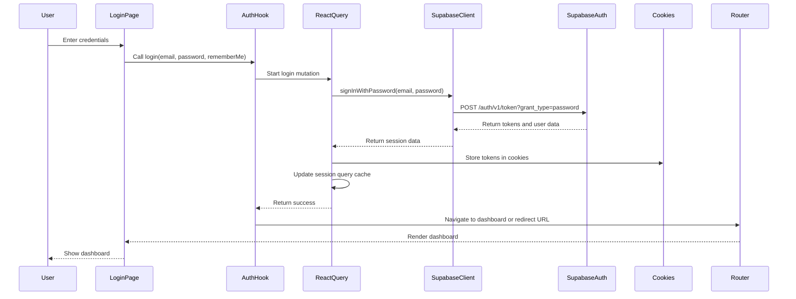
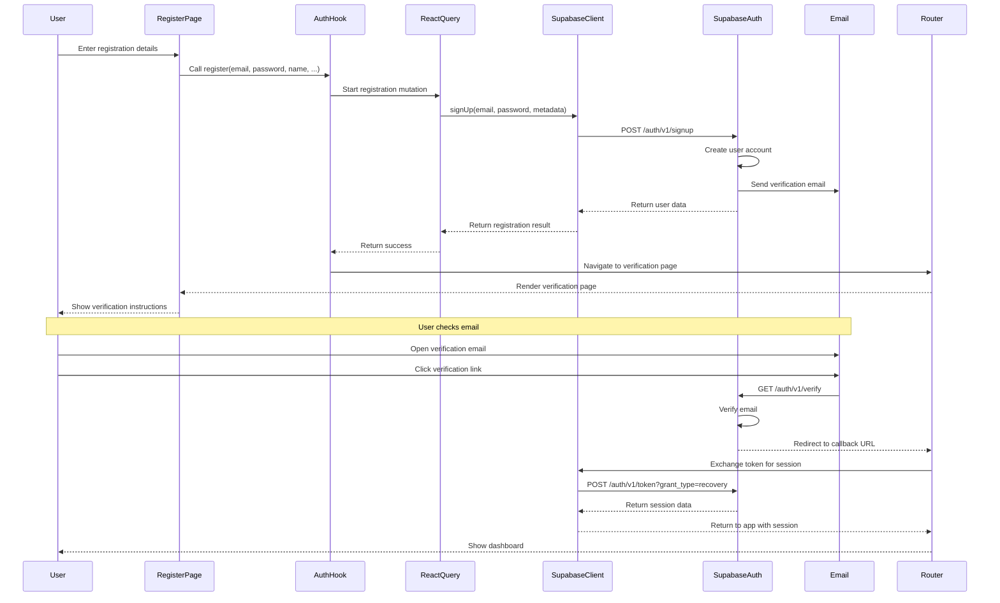
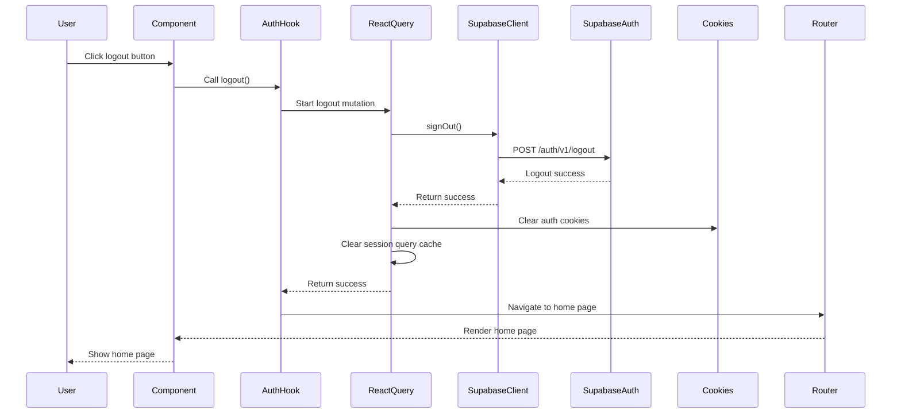
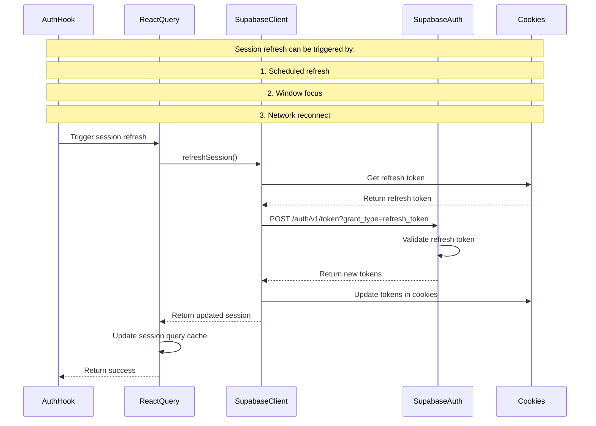
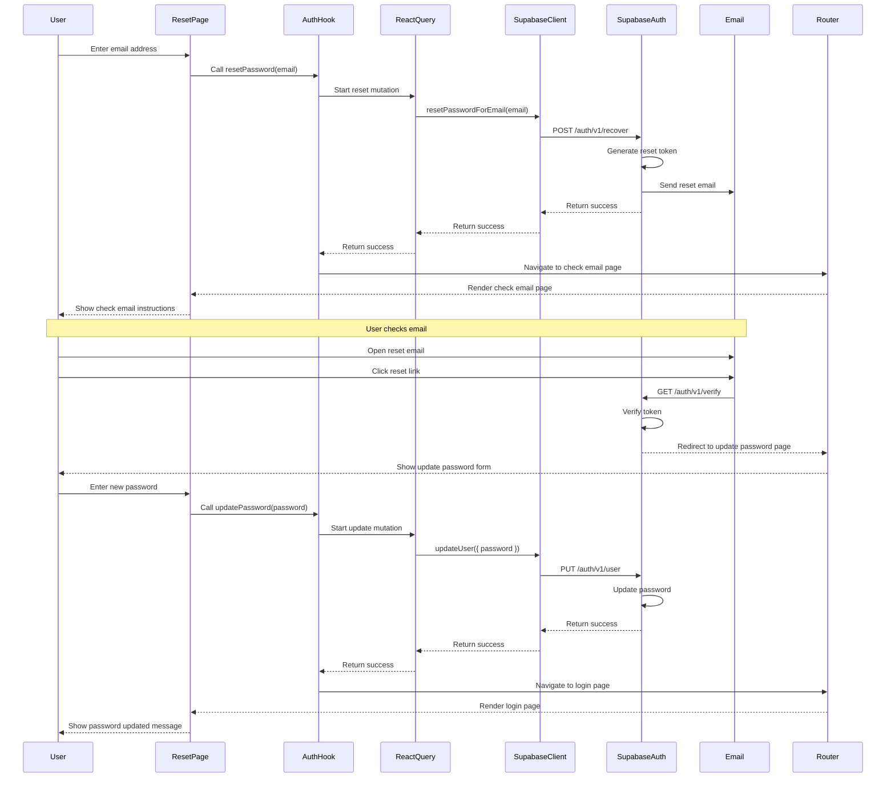
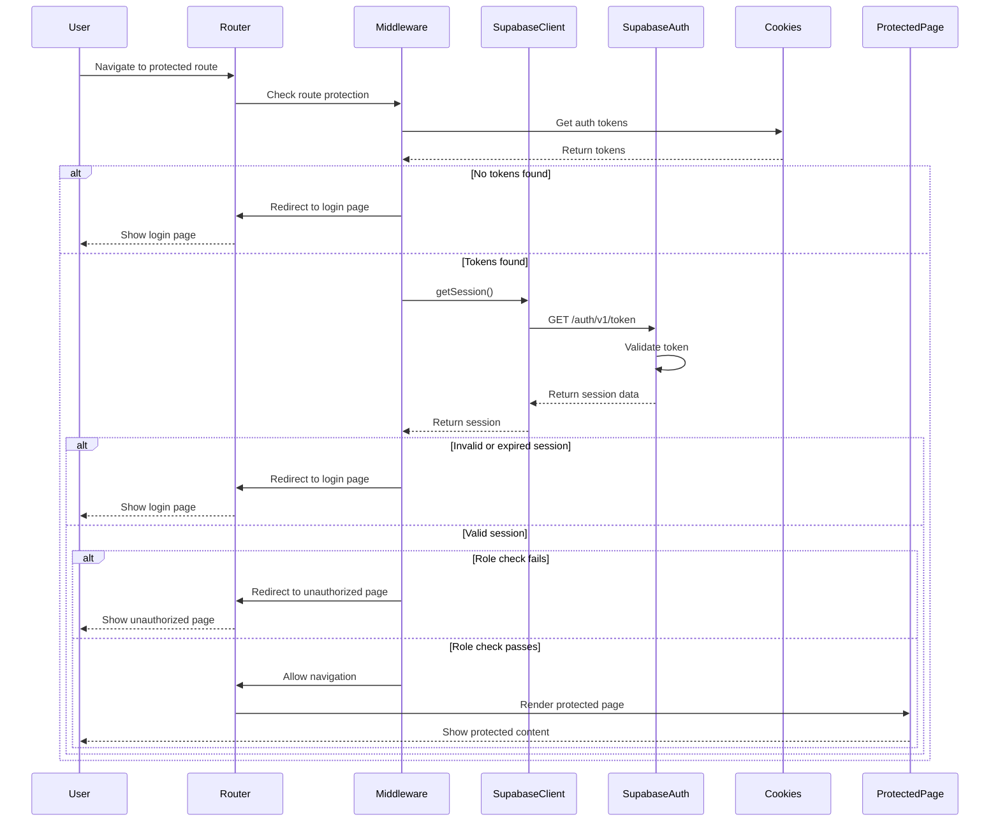
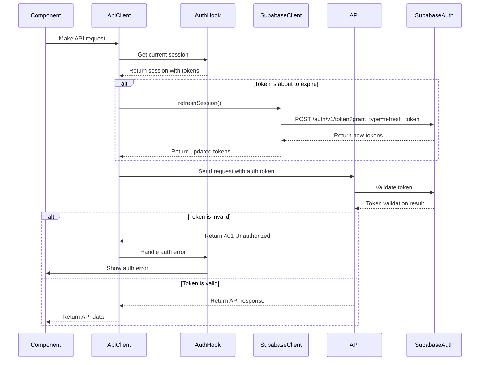
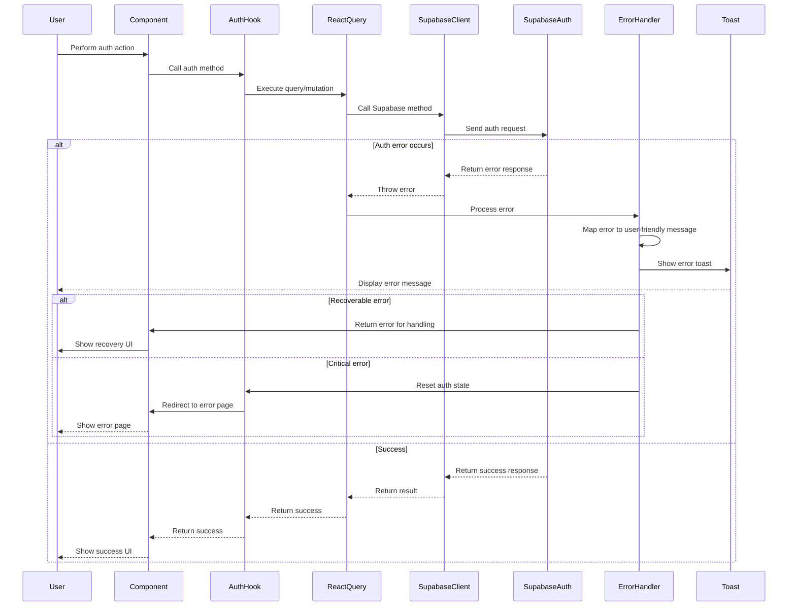

# Authentication Flow Sequence Diagrams

This document provides detailed sequence diagrams for the authentication flows in the NGDI Portal application.

## Login Flow

## Registration Flow

## Logout Flow

## Session Refresh Flow

## Password Reset Flow

## Protected Route Flow

## Token Refresh on API Request Flow

## Error Handling Flow

