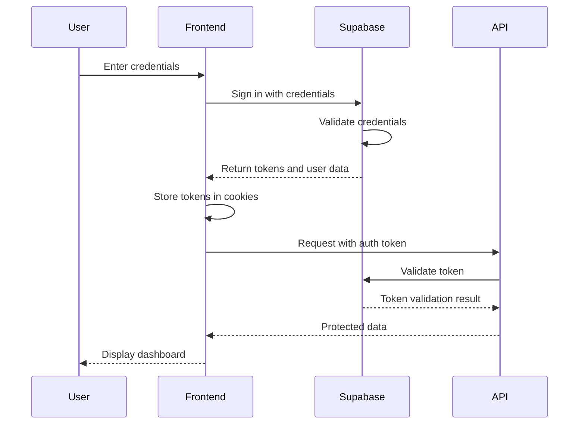
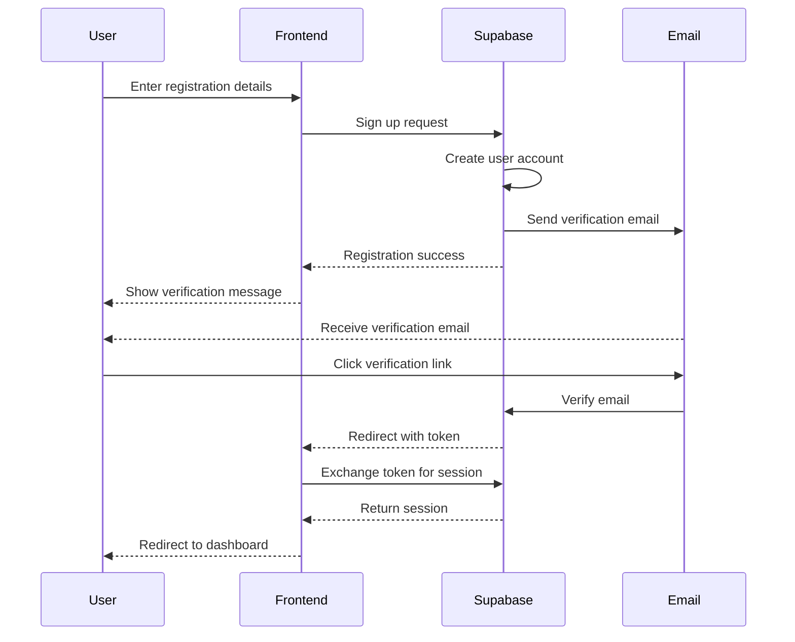
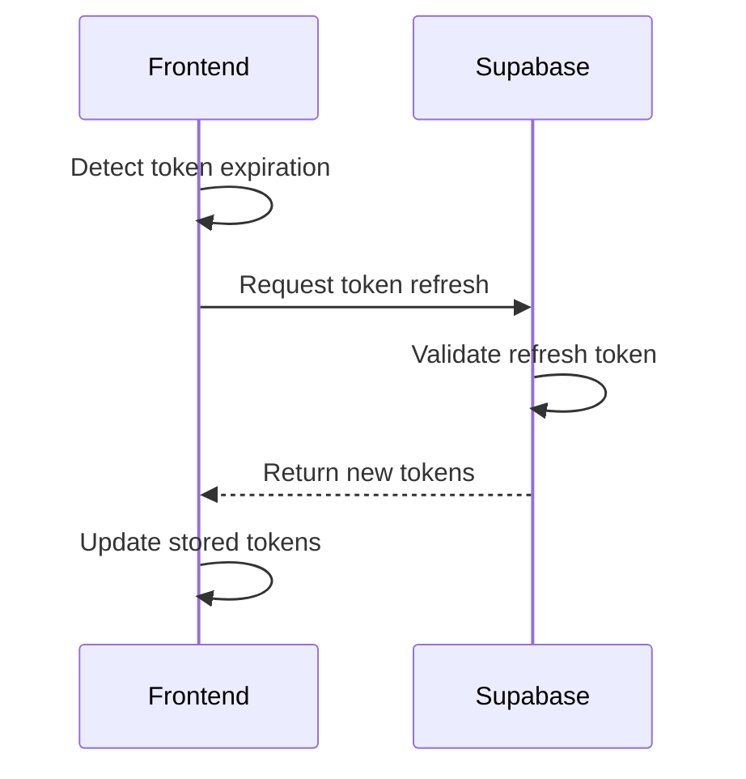

# NGDI Portal Authentication System

This document provides a comprehensive overview of the authentication system used in the NGDI Portal application.

## Table of Contents

1. [Overview](#overview)
2. [Architecture](#architecture)
3. [Authentication Flow](#authentication-flow)
4. [Configuration](#configuration)
5. [Frontend Integration](#frontend-integration)
6. [Backend Integration](#backend-integration)
7. [Security Features](#security-features)
8. [Performance Optimizations](#performance-optimizations)
9. [Type Safety](#type-safety)
10. [Common Usage Patterns](#common-usage-patterns)
11. [Troubleshooting](#troubleshooting)

## Overview

The NGDI Portal uses Supabase Auth for authentication, providing a secure and scalable solution for user management. The authentication system handles user registration, login, session management, and role-based access control.

### Key Features

- **Secure Authentication**: Uses industry-standard security practices
- **Role-Based Access Control**: Supports different user roles with specific permissions
- **Session Management**: Handles session creation, validation, and expiration
- **Type-Safe Implementation**: Comprehensive TypeScript types for auth-related code
- **Performance Optimized**: Efficient caching and token handling
- **Comprehensive Error Handling**: Detailed error messages and recovery mechanisms

## Architecture

The authentication system follows a layered architecture:

### Frontend Architecture

```
packages/web/src/lib/auth/
├── auth-types.ts           # Type definitions
├── supabase-auth.config.ts # Configuration
├── config-schema.ts        # Configuration validation
├── role-guards.ts          # Role-based type guards
├── query-config.ts         # React Query configuration
├── metadata-cache.ts       # User metadata caching
├── cookie-manager.ts       # Cookie handling
└── constants.ts            # Constants and enums
```

### Backend Architecture

```
packages/api/src/
├── middleware/
│   └── supabase-auth.middleware.ts # Auth middleware
├── services/
│   └── supabase-auth.service.ts    # Auth service
└── config/
    └── supabase-auth.config.ts     # Auth configuration
```

## Authentication Flow

### Login Flow

1. User enters credentials on the login page
2. Frontend sends credentials to Supabase Auth
3. Supabase validates credentials and returns tokens
4. Frontend stores tokens securely in cookies
5. User is redirected to the dashboard or requested page



### Registration Flow

1. User enters registration details
2. Frontend sends registration request to Supabase Auth
3. Supabase creates user account and sends verification email
4. User is redirected to verification page
5. User verifies email by clicking link in email
6. User is redirected to login page or automatically logged in



### Session Refresh Flow

1. Frontend detects token is about to expire
2. Frontend sends refresh token to Supabase Auth
3. Supabase validates refresh token and issues new tokens
4. Frontend updates stored tokens



## Configuration

The authentication system is configured through the `supabase-auth.config.ts` file, which provides a comprehensive set of configuration options.

### Key Configuration Options

```typescript
const authConfig = {
  // Routes configuration
  routes: {
    protected: ["/dashboard", "/profile", ...],
    admin: ["/admin", "/admin/analytics", ...],
    nodeOfficer: ["/node", "/metadata/create", ...],
  },
  
  // Session configuration
  session: {
    maxAge: 30 * 24 * 60 * 60, // 30 days in seconds
    updateAge: 4 * 60 * 60,    // Refresh every 4 hours
    rememberMeAge: 30 * 24 * 60 * 60, // 30 days for remember me
  },
  
  // Security configuration
  security: {
    passwordMinLength: 12,
    maxLoginAttempts: 5,
    lockoutDuration: 15 * 60, // 15 minutes
    // ... other security settings
  },
  
  // ... other configuration sections
}
```

### Configuration Validation

The configuration is validated at runtime using Zod schemas to ensure all values are correct:

```typescript
import { authConfigSchema, validateAuthConfig } from "./config-schema"

// Validate the configuration
export const supabaseAuthConfig = validateAuthConfig(authConfig)
```

## Frontend Integration

### Using the Auth Hook

The primary way to interact with authentication in components is through the `useAuthSession` hook:

```tsx
import { useAuthSession } from "@/hooks/use-auth-session"

function ProfilePage() {
  const { 
    user, 
    isAuthenticated, 
    isAdmin,
    logout 
  } = useAuthSession()
  
  if (!isAuthenticated) {
    return <div>Please log in to view your profile</div>
  }
  
  return (
    <div>
      <h1>Welcome, {user.name}</h1>
      {isAdmin() && <AdminControls />}
      <button onClick={logout}>Log out</button>
    </div>
  )
}
```

### Protected Routes

Routes can be protected using the `ProtectedRoute` component:

```tsx
import { ProtectedRoute } from "@/components/auth/protected-route"
import { UserRole } from "@/lib/auth/constants"

function AdminPage() {
  return (
    <ProtectedRoute allowedRoles={[UserRole.ADMIN]}>
      <AdminDashboard />
    </ProtectedRoute>
  )
}
```

### Login Form

```tsx
import { useAuthSession } from "@/hooks/use-auth-session"

function LoginForm() {
  const { login, isLoggingIn } = useAuthSession()
  const [email, setEmail] = useState("")
  const [password, setPassword] = useState("")
  const [rememberMe, setRememberMe] = useState(false)
  
  const handleSubmit = async (e) => {
    e.preventDefault()
    try {
      await login(email, password, rememberMe)
    } catch (error) {
      console.error("Login failed:", error)
    }
  }
  
  return (
    <form onSubmit={handleSubmit}>
      {/* Form fields */}
      <button type="submit" disabled={isLoggingIn}>
        {isLoggingIn ? "Logging in..." : "Log in"}
      </button>
    </form>
  )
}
```

## Backend Integration

### Auth Middleware

The API uses auth middleware to protect routes:

```typescript
import { supabaseAuthMiddleware } from "../middleware/supabase-auth.middleware"

// Apply middleware to all routes
app.use("*", supabaseAuthMiddleware())

// Apply middleware to specific routes
app.use("/api/admin/*", supabaseAuthMiddleware({ role: "ADMIN" }))
```

### Accessing User in Route Handlers

```typescript
import { Context } from "hono"

export async function getUserProfile(c: Context) {
  // User is attached to the context by the auth middleware
  const user = c.get("user")
  
  if (!user) {
    return c.json({ error: "Unauthorized" }, 401)
  }
  
  // Fetch user profile from database
  const profile = await prisma.userProfile.findUnique({
    where: { userId: user.id },
  })
  
  return c.json({ profile })
}
```

## Security Features

The authentication system implements several security features:

### Token Security

- **HTTP-Only Cookies**: Sensitive tokens are stored in HTTP-only cookies
- **Secure Flag**: Cookies are sent only over HTTPS in production
- **SameSite Policy**: Cookies use "strict" or "lax" SameSite policy
- **Short Lifetimes**: Access tokens have short lifetimes (24 hours)
- **Refresh Tokens**: Longer-lived refresh tokens (7 days) for session persistence

### CSRF Protection

- **PKCE Flow**: Uses PKCE (Proof Key for Code Exchange) flow for better security
- **CSRF Tokens**: Critical operations require CSRF tokens
- **SameSite Cookies**: Prevents cross-site request forgery

### Rate Limiting

- **Login Attempts**: Limits login attempts to prevent brute force attacks
- **Account Registration**: Limits account registration to prevent spam
- **Password Reset**: Limits password reset requests

### Password Security

- **Strong Password Policy**: Requires complex passwords
- **Secure Storage**: Passwords are hashed and salted by Supabase
- **Password Reset**: Secure password reset flow

## Performance Optimizations

The authentication system includes several performance optimizations:

### Caching

- **React Query**: Uses React Query for efficient data fetching and caching
- **User Metadata**: Caches user metadata in localStorage
- **Session State**: Optimized session state management

### Token Management

- **Efficient Token Refresh**: Refreshes tokens before they expire
- **Background Refresh**: Refreshes tokens in the background
- **Optimistic Updates**: Updates UI optimistically during auth operations

### Cookie Optimization

- **Minimal Cookie Size**: Stores only essential data in cookies
- **Cookie Partitioning**: Separates sensitive and non-sensitive data
- **Reduced Updates**: Minimizes unnecessary cookie updates

## Type Safety

The authentication system uses comprehensive TypeScript types:

### Auth State

```typescript
export type AuthState =
  | { status: "loading"; user: null; session: null; error: null }
  | { status: "authenticated"; user: AuthUser; session: AuthSession; error: null }
  | { status: "unauthenticated"; user: null; session: null; error: null }
  | { status: "error"; user: null; session: null; error: AuthError }
```

### Role-Based Type Guards

```typescript
// Type guard for admin role
export function isAdmin(user: AuthUser | null): user is AuthUser & { role: UserRole.ADMIN } {
  return !!user && user.role === UserRole.ADMIN
}

// Usage
if (isAdmin(user)) {
  // TypeScript knows user.role is UserRole.ADMIN here
  console.log("User is an admin")
}
```

### Permission Checking

```typescript
// Check if user has a specific permission
export function hasPermission(user: AuthUser | null, permission: PermissionEnum): boolean {
  if (!user) return false
  
  const userPermissions = ROLE_PERMISSIONS[user.role] || []
  return userPermissions.includes(permission)
}

// Usage
if (hasPermission(user, PermissionEnum.CREATE_METADATA)) {
  // User has permission to create metadata
}
```

## Common Usage Patterns

### Checking Authentication Status

```tsx
import { useAuthSession } from "@/hooks/use-auth-session"

function MyComponent() {
  const { status, isAuthenticated } = useAuthSession()
  
  if (status === "loading") {
    return <div>Loading...</div>
  }
  
  if (!isAuthenticated) {
    return <div>Please log in</div>
  }
  
  return <div>Authenticated content</div>
}
```

### Role-Based Access Control

```tsx
import { useAuthSession } from "@/hooks/use-auth-session"
import { PermissionEnum } from "@/lib/auth/auth-types"

function MetadataActions() {
  const { user, hasPermission } = useAuthSession()
  
  const canCreate = hasPermission(user, PermissionEnum.CREATE_METADATA)
  const canUpdate = hasPermission(user, PermissionEnum.UPDATE_METADATA)
  const canDelete = hasPermission(user, PermissionEnum.DELETE_METADATA)
  
  return (
    <div>
      {canCreate && <button>Create</button>}
      {canUpdate && <button>Update</button>}
      {canDelete && <button>Delete</button>}
    </div>
  )
}
```

### Handling Auth Errors

```tsx
import { useAuthSession } from "@/hooks/use-auth-session"

function LoginForm() {
  const { login, isLoggingIn, error } = useAuthSession()
  
  // Form state and handlers...
  
  return (
    <form onSubmit={handleSubmit}>
      {/* Form fields */}
      
      {error && (
        <div className="error">
          {error.message}
        </div>
      )}
      
      <button type="submit" disabled={isLoggingIn}>
        {isLoggingIn ? "Logging in..." : "Log in"}
      </button>
    </form>
  )
}
```

## Troubleshooting

### Common Issues

#### Session Not Persisting

- Check that cookies are being set correctly
- Verify that the domain and path are configured correctly
- Ensure that the SameSite policy is appropriate for your use case

#### Token Refresh Issues

- Check that the refresh token is being stored correctly
- Verify that the token refresh logic is working correctly
- Ensure that the token refresh is happening before the token expires

#### Role-Based Access Issues

- Check that the user's role is being set correctly
- Verify that the role-based access control logic is working correctly
- Ensure that the user has the necessary permissions

### Debugging

- Check the browser console for errors
- Use the React DevTools to inspect the auth state
- Check the network tab for auth-related requests
- Use the application tab to inspect cookies and localStorage

### Common Error Codes

- `auth/invalid-credentials`: Invalid email or password
- `auth/user-not-found`: User not found
- `auth/email-already-exists`: Email already in use
- `auth/weak-password`: Password does not meet requirements
- `auth/expired-token`: Token has expired
- `auth/invalid-token`: Token is invalid
- `auth/email-not-verified`: Email not verified
- `auth/unauthorized`: User not authorized
- `auth/forbidden`: User does not have permission
- `auth/rate-limited`: Too many requests
- `auth/server-error`: Server error
- `auth/network-error`: Network error
