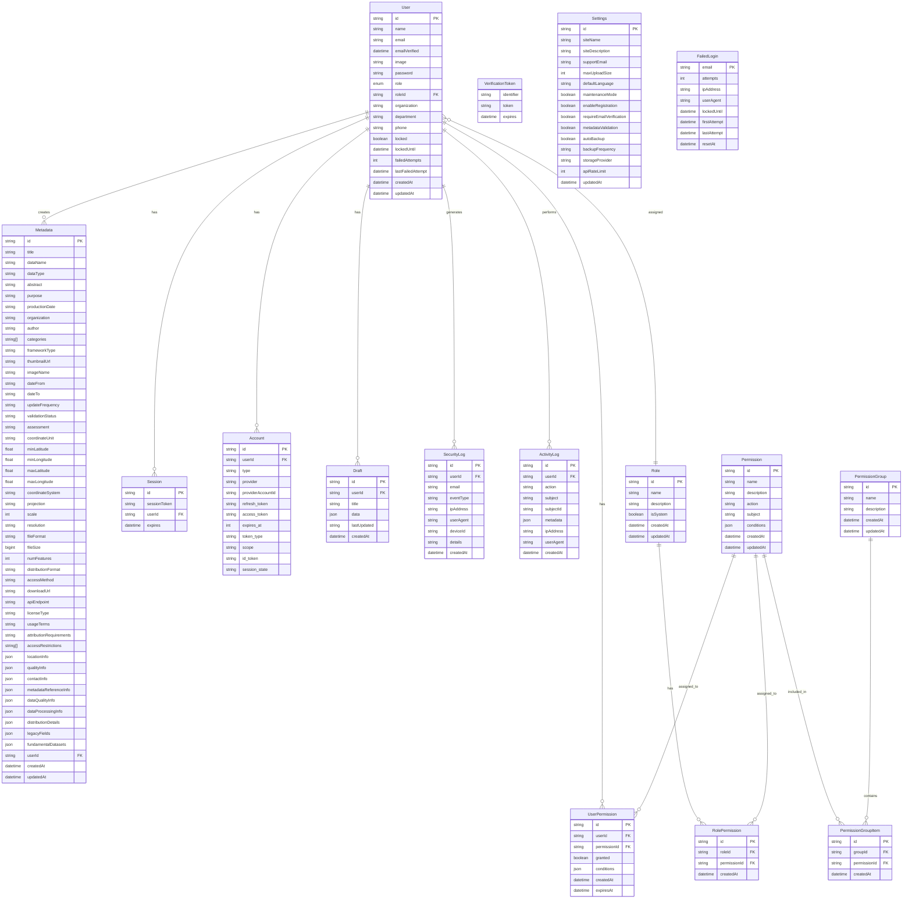

# Database Entity-Relationship Diagram

This document provides an entity-relationship diagram for the NGDI Portal database.

## Overview

The NGDI Portal database consists of several interconnected entities that represent the core functionality of the application. The main entities are:

1. **User**: Represents a user of the system
2. **Metadata**: Represents geospatial metadata information
3. **Role**: Represents a user role with associated permissions
4. **Permission**: Represents a permission that can be assigned to roles or users
5. **SecurityLog**: Represents a security event log
6. **ActivityLog**: Represents a user activity log

## Entity-Relationship Diagram

## Entity Relationships

### User Relationships

- **User to Metadata**: One-to-many relationship. A user can create multiple metadata entries.
- **User to Session**: One-to-many relationship. A user can have multiple sessions.
- **User to Account**: One-to-many relationship. A user can have multiple OAuth accounts.
- **User to Draft**: One-to-many relationship. A user can have multiple drafts.
- **User to SecurityLog**: One-to-many relationship. A user can generate multiple security logs.
- **User to ActivityLog**: One-to-many relationship. A user can perform multiple activities.
- **User to UserPermission**: One-to-many relationship. A user can have multiple direct permissions.
- **User to Role**: Many-to-one relationship. Many users can be assigned to a single role.

### Role and Permission Relationships

- **Role to RolePermission**: One-to-many relationship. A role can have multiple permissions.
- **Permission to RolePermission**: One-to-many relationship. A permission can be assigned to multiple roles.
- **Permission to UserPermission**: One-to-many relationship. A permission can be assigned to multiple users directly.
- **Permission to PermissionGroupItem**: One-to-many relationship. A permission can be included in multiple permission groups.
- **PermissionGroup to PermissionGroupItem**: One-to-many relationship. A permission group can contain multiple permissions.

## Key Entities

### User Entity

The User entity represents a user of the system. It contains information about the user's identity, authentication, and role.

### Metadata Entity

The Metadata entity represents geospatial metadata information. It contains detailed information about geospatial datasets, including their properties, location, quality, and distribution details.

### Role and Permission Entities

The Role and Permission entities implement a comprehensive permission system. Roles are assigned to users, and permissions are assigned to roles. Permissions can also be assigned directly to users through the UserPermission entity.

### Log Entities

The SecurityLog and ActivityLog entities track security events and user activities. They provide an audit trail for security and compliance purposes.

## Conclusion

This entity-relationship diagram provides a comprehensive view of the NGDI Portal database structure. It shows the relationships between entities and the attributes of each entity.
